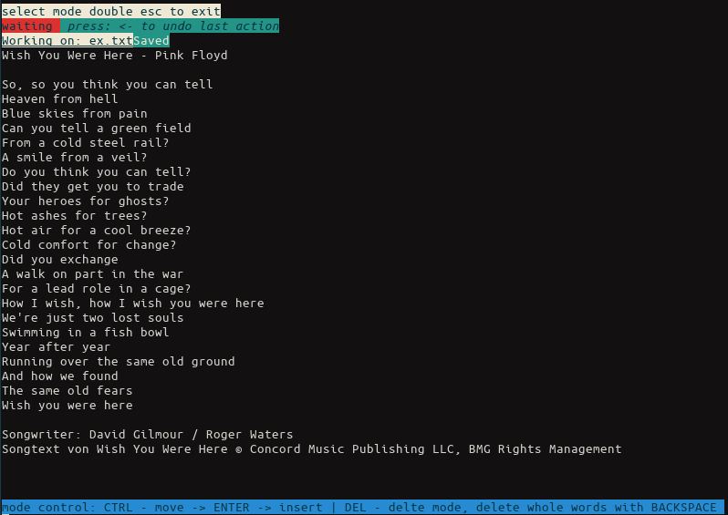
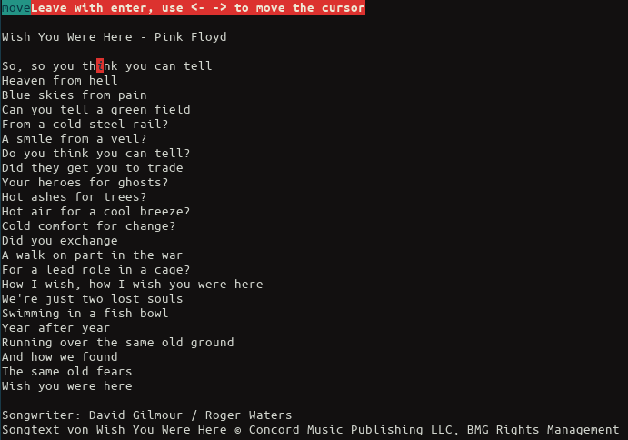
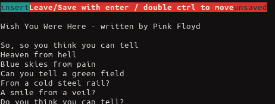
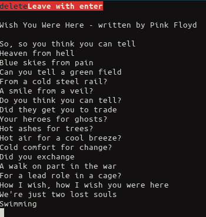

# PyTextCLI

This is a simple python based texteditor, which is meant to be used as commandline tool, like vim, vi, nano etc. ...

# Installation

Make sure python3 is insalled on your machine and install the dependencies with : `pip3 install -r req.txt`

# Usage

Edit a Text file with the PyTextCLI like this example: `main.py /path/to/textfile`. Remember the TextCLI is a very simple
tool which auto-saves all changes done to the input file.

# Overview 

### Main Menu

*select a Mode, choose between Move + Insert or Delete*

### Move Cursor Mode

*Move the cursor to the any position in the text file, using the arrow keys*

### Insert Mode

*Insert and remove Text, where you left the cursor*

### Delete Mode

*Delete whole words or lines*
